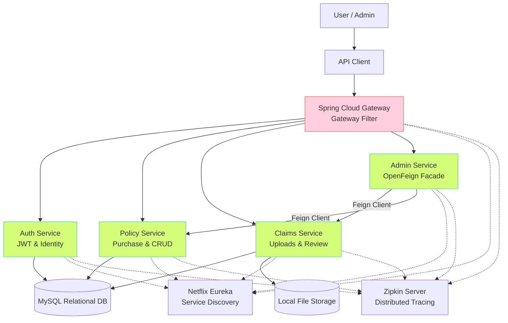
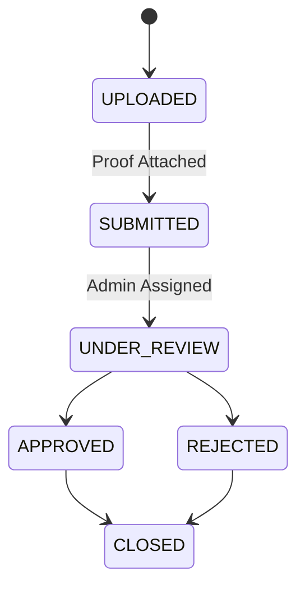
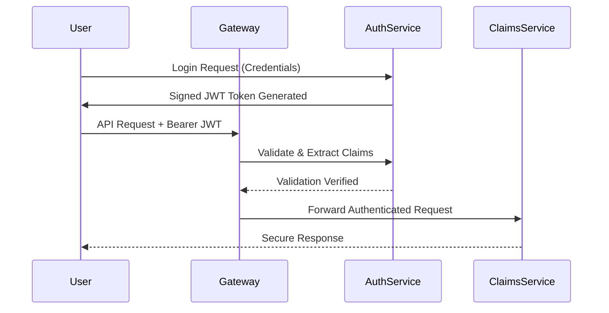
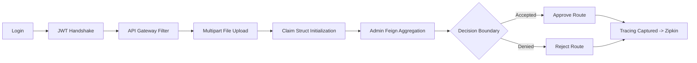

<h1 align="center" style="font-size:40px;">
 🛡️ SmartSure Insurance Microservices System 
</h1>

<p align="center">
  
  
  
  
  
  
  
  
</p>

----

# 📖 Project Overview

<p align="justify">

**SmartSure Insurance Management System** is an advanced, enterprise-grade backend platform designed to completely digitize the insurance lifecycle using a scalable microservices architecture.

Customers can register, purchase customized insurance policies, calculate dynamic premiums, upload physical claim documents securely, and initiate insurance claims through secure REST APIs. 

Administrative users can manage active insurance products, verify physical claim documentation, approve or reject lifecycle claims, and generate operational analytics reports.

The ecosystem is built upon independent **Spring Boot 3** microservices, centrally orchestrated by **Spring Cloud Gateway** for strict API routing. Each module maintains isolated state structures and local databases, communicating asynchronously via REST APIs and **OpenFeign** clients, while maintaining robust **Micrometer & Zipkin** distributed tracing.

</p>

<p align="center">
  
</p>

---

## 🏛️ System Architecture (High Level Design)



---

# 🔄 Claim Lifecycle (Business Flow)



---

# 🔐 Authentication Flow (JWT Security)



---

# 👥 Roles & Permissions

## 🟢 Customer Focus
* Secure Login & receive JWT validation tokens.
* Execute policy purchases and bindings.
* Interrogate personal policy statuses.
* Upload physical claim validation documents `(multipart/form-data)`.
* Initiate official claim processing routines.
* Track lifecycle status of active claims in real-time.

## 🔴 Administrative Focus
* Create, update, and deprecate system Policies.
* Review all active system claims and associated `uploads/` files.
* Authoritatively Approve or Reject claims modifying their downstream state.
* Aggregate and generate cross-service operational reports.
* Override general customer operational boundaries securely.

---

# 🛠️ Tech Stack & Technologies

| Category | Technology |
|---|---|
| **Core Framework** | Java 21, Spring Boot 3.x |
| **Microservices Cloud** | Spring Cloud Gateway, Netflix Eureka |
| **Communication** | REST APIs, OpenFeign Clients |
| **Security & Auth** | Spring Security, JSON Web Tokens (JWT) |
| **Observability** | Micrometer, Zipkin (Distributed Tracing) |
| **Testing** | JUnit 5, Mockito, Spring WebMvcTest |
| **Database** | MySQL (Isolated DBs), Spring Data JPA |
| **Tooling** | Maven, Lombok, Swagger / OpenAPI 3.0 |

---

# 📁 Microservices Structure

```bash
SmartSure-Insurance/
│
├── api-gateway/       # Port 8080 : Handles Routing & Authentication Filters
├── auth-service/      # Port 8081 : Security Contexts, JWT logic & Registration
├── policy-service/    # Port 8082 : Insurance Product Offerings & Purchasing
├── claims-service/    # Port 8083 : Multipart File Storage & Lifecycle Routing
├── admin-service/     # Port 8084 : Aggregation Facade & OpenFeign Integrations 
├── eureka-server/     # Port 8761 : Local Service Registry & Discovery
```

---

# 📡 Key API Endpoints

### 🔑 Auth Service
* `POST /api/auth/register` - Register a Customer/Admin identity.
* `POST /api/auth/login` - Authenticate and yield a signed token.

### 📜 Policy Service
* `GET /api/policies` - (Public) List all active policies.
* `POST /api/policies/purchase` - (Customer) Formally purchase an active policy.
* `POST /api/admin/policies` - (Admin) Inject a new valid policy into the market.

### 📋 Claims Service
* `POST /api/claims/upload` - (Customer) Upload a physical `PDF` / `Image` to local file storage.
* `POST /api/claims/initiate` - (Customer) Link an upload ID to a formal system claim.
* `GET /api/claims/internal/claims` - (Internal) OpenFeign fetching routes bypassing external security configurations.

---

# 🔬 Quality Assurance & Testing Strategy

To ensure enterprise-level code quality, strict testing paradigms are heavily utilized within every microservice boundary.

* **✅ Unit Testing (`@MockBean`)**: Isolated `@Service` business-logic validation using **JUnit 5** and **Mockito** to strictly mock database calls and secondary dependencies without booting a heavy context.
* **✅ Controller Integration (`MockMvc`)**: `MockMvcBuilders` are utilized across all modules mimicking raw HTTP protocol transactions ensuring Servlet Exceptions, JSON serializers, and headers intercept correctly.
* **✅ API Definition**: Fully documented interactive GUI visualizations mapped over **Swagger / OpenAPI 3.0**.
* **✅ Lifecycle Flow**: Advanced postman scripting evaluating multipart mappings and token interceptions dynamically.

---

# 🔍 Observability & Distributed Tracing

This project features a fully capable **Micrometer Tracing** bridge configured to export telemetry data natively to **Zipkin**. 
This establishes complete visual visibility tracking a single origin request from the `api-gateway` traversing down to `admin-service` invoking OpenFeign networks internally directly within a live visual dashboard.

---

# 📊 End-to-End System Flow



---

# 🏆 Key Architectural Solutions Demonstrated

* **Distributed Authentication**: Intercepting headless JWT tokens reliably using custom Spring Cloud Gateway filter mappings.
* **Service Networking**: Eliminating static routing boundaries by implementing dynamic Eureka DNS lookup variables.
* **Synchronous Aggregation**: Leveraging Spring OpenFeign to establish Internal-only controller endpoints strictly utilized server-to-server.
* **Unstructured Input Management**: Handling raw `multipart/form-data` inside distributed nodes seamlessly translating byte-streams into physical OS `/uploads`.
* **Deep System Transparency**: 100% Probability Sampling routing into Zipkin via Micrometer allowing millisecond bottleneck analysis across remote instances.
* **Strict Unit Coverage**: Validating internal methods systematically assuring continuous deployment integrity without DB dependencies.

---

# 🚀 Future Enhancements

* React-based frontend dashboard visualization.
* Advanced Docker containerization & orchestration mappings.
* Message Queues (RabbitMQ/Kafka) for asynchronous notification deliveries.
* Cloud Provider deployment routing (AWS EC2 / Render).

---

# 📄 Academic License & Acknowledgement

This project is expertly constructed as part of a **Capgemini Spring Boot Microservices Evaluation Program.**
It operates as a demonstration and evaluation architecture designed for strict academic and simulated organizational environments.

You are free to:
- View and audit the modular code configurations.
- Utilize architectural design choices for practice and learning.
- Reference internal dependencies in comparable environments.

⚠️ You are NOT allowed to:
- Copy or clone this system for your own direct academic assessments.
- Monetize these endpoints for immediate commercial viability without express engineering permission.

---

# © Copyright

**© 2026 SmartSure Insurance System**  

Engineered structurally under the **Capgemini Spring Boot Microservices Evaluation Program**.  
*All engineering rights reserved.*

---

**Final Note:**  
*This implementation is designed to reflect best-practice engineering standards prevalent in scalable Fortune 500 tech stacks today.*
