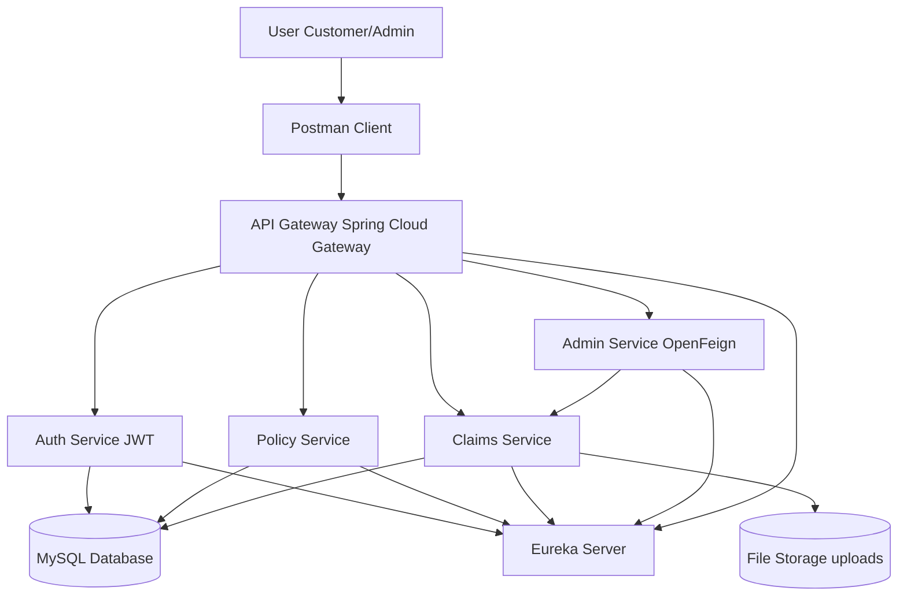
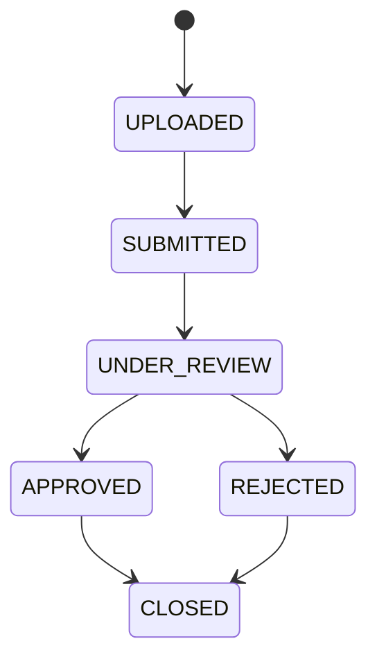
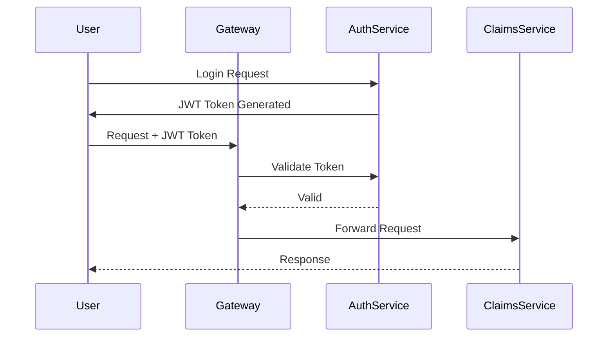
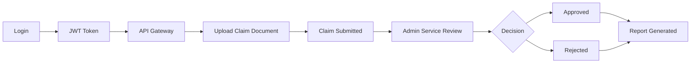

<h1 align="center" style="font-size:40px;">
 SmartSure Insurance Microservices System 
</h1>

<p align="center">
  
  
  
  
  
  
</p>

----

# Project Overview

<p align="justify">

SmartSure Insurance Management System is a microservices-based backend platform designed to digitize the complete insurance lifecycle.

Customers can register, purchase insurance policies, calculate premiums, upload claim documents, and initiate insurance claims through secure REST APIs.

Administrative users manage insurance products, verify claim documentation, approve or reject claims, and generate operational reports.

The system is built using Spring Boot microservices, with Spring Cloud Gateway acting as the API gateway for routing requests to backend services.

Each microservice maintains its own database and communicates with other services through REST APIs and OpenFeign clients.

A frontend layer (React or Angular) can be integrated for user interaction and visualization.

</p>

<p align="center">
  
</p>

---

## System Architecture (High Level Design)



---

# Claim Lifecycle (Business Flow)



---

# Authentication Flow (JWT Security)



---

# Roles in System

## Customer

* Login & receive JWT token
* Can Purchase Policy
* View the policy
* Upload claim documents (PDF/Image)
* Initiate claims
* Track claim status

## Admin

* Create Policy
* Update Policy
* Delete Policy
* View policies
* Review claims
* Approve / Reject claims
* Generate reports
* Monitor system activity

---

# Tech Stack

* Java 21
* Spring Boot
* Spring Security + JWT
* Spring Cloud Gateway
* Eureka Service Discovery
* OpenFeign
* MySQL
* Maven
* Swagger API Docs
* Postman Testing

---

# Microservices Structure

```bash
SmartSure-Insurance/
│
├── api-gateway
├── auth-service
├── policy-service
├── claims-service
├── admin-service
├── eureka-server


```

---

# API Endpoints

## Auth Service

* POST `/api/auth/register`
* POST `/api/auth/login`

## Policy Service

### Public

* GET `/api/policies`
* GET `/api/policies/{id}`

### Customer

* POST `/api/policies/purchase`

### Admin

* POST `/api/admin/policies`
* PUT `/api/admin/policies/{id}`
* DELETE `/api/admin/policies/{id}`

## Claims Service

### Customer

* POST `/api/claims/upload`
* POST `/api/claims/initiate`
* GET `/api/claims/status/{id}`

### Internal (Used via OpenFeign)

* PUT `/api/claims/internal/claims/review/{id}`
* GET `/api/claims/internal/claims`
* GET `/api/claims/internal/claims/reports`

## Admin Service

* PUT `/api/admin/claims/{id}/review`
* GET `/api/admin/claims`
* GET `/api/admin/reports`

---

# File Upload System

* Supports PDF & Image uploads
* Stored in local file system (`uploads/`)
* Linked with claim records in DB
* Used during claim submission lifecycle

---

# Testing Strategy

## ✔ Swagger UI

* API visualization & testing

## ✔ Postman

* End-to-end microservice testing
* JWT authentication validation
* File upload (multipart) testing
* Full claim workflow testing

---

# End-to-End System Flow



---

# Key Challenges Solved

* JWT authentication across microservices
* API Gateway routing & filter chain issues
* Eureka service registration & discovery
* OpenFeign service-to-service communication
* File upload handling in distributed system
* End-to-end workflow consistency

---

# Future Enhancements

* React-based frontend dashboard
* Email notifications (claim updates)
* Docker containerization
* Logging & monitoring system
* Cloud deployment (AWS / Render)

---

# What This Project Demonstrates

* Microservices architecture design
* Secure authentication (JWT)
* Real-world workflow simulation
* Distributed system communication
* Backend system design thinking

---

# 📄 License

This project is developed as part of a **Capgemini Spring Boot Microservices Evaluation Program**.

This repository is intended for **learning, academic submission, and demonstration purposes only**.

You are free to:
- View and understand the code  
- Use it for learning and practice  
- Reference it for building similar projects  

You are NOT allowed to:
- Copy and submit it as your own work in evaluations  
- Use it for commercial purposes without permission  

---

# © Copyright

© 2026 SmartSure Insurance System  

Developed under **Capgemini Spring Boot Microservices Evaluation Program**.

All rights reserved.

---

# Final Note

This project is a **production-style backend simulation** designed to understand how scalable enterprise systems are built using microservices architecture.

It reflects real-world backend engineering concepts used in modern companies.
